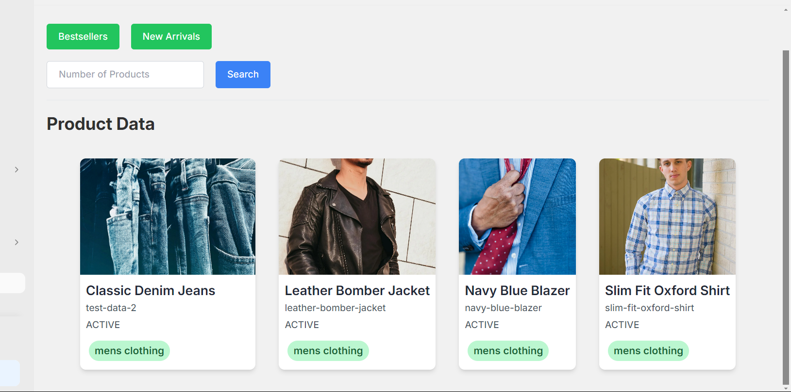
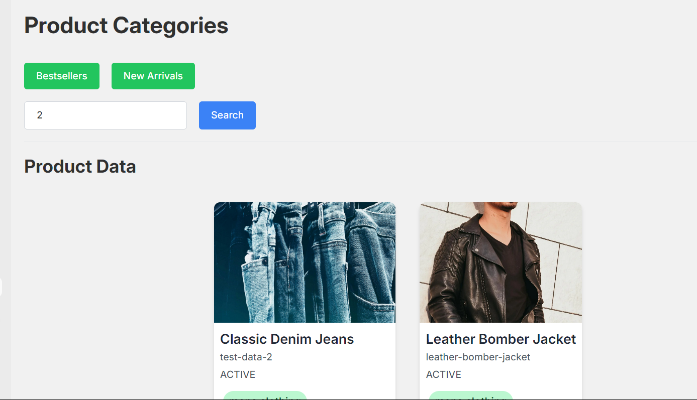

# Shopify Application Documentation

## Overview
This documentation provides an overview of a Shopify application that fetches and displays product data using Shopify's GraphQL API. The application allows users to view products based on different categories (e.g., bestsellers, new arrivals) and filter by the number of products displayed.

## Features
- Fetch and display product data from Shopify using GraphQL API.
- Filter products by categories such as bestsellers and new arrivals.
- Dynamically change the number of products displayed based on user input.

## Components
The application consists of two main components:
1. **Backend Server**: Built with Node.js and Express, responsible for handling requests from the frontend and fetching data from Shopify's GraphQL API.
2. **Frontend React Application**: Displays product data fetched from the backend and allows users to interact with the data through category buttons and a product limit input.

## Backend Server
The backend server is responsible for:
- Establishing a connection to Shopify's GraphQL API using Axios.
- Fetching product data based on specified categories and product limits.
- Handling CORS (Cross-Origin Resource Sharing) to allow requests from the frontend.

### Server Files
- **server.js**: Entry point for the backend server. Defines routes to fetch product data and handles CORS.

### Dependencies
- **Express**: Web framework for Node.js to handle routing.
- **Axios**: HTTP client for making requests to Shopify's GraphQL API.
- **dotenv**: Loads environment variables from a `.env` file.
- **cors**: Middleware to enable CORS for handling cross-origin requests.

### Environment Variables
Ensure the following environment variables are set in a `.env` file:
- `SHOP_NAME`: Shopify store name.
- `ADMIN_API_ACCESS_TOKEN`: Shopify admin API access token.

### Running the Backend Server
1. **Setup**: Install dependencies using `npm install`.
2. **Start**: Run the server using `node server.js`.

## Frontend React Application
The frontend application displays fetched product data and allows users to interact with the data through category buttons and a product limit input.

### Components
- **ProductData.js**: Main component that fetches and displays product data.
- **ProductList.js**: Renders a list of products fetched from the backend.
- **ProductCard.js**: Renders individual product cards with details like title, image, tags, and a link to view on the store.

### Functionality
- **Fetch Data**: Fetches product data from the backend based on selected categories (e.g., bestsellers, new arrivals) and product limits.
- **Display**: Renders product data in a responsive layout with product cards.
- **Interaction**: Allows users to filter products by category and specify the number of products displayed.

### Running the Frontend Application
1. **Setup**: Install dependencies using `npm install`.
2. **Start**: Run the development server using `npm start`.

## Integration Methods
- **Script Embedding**: Provide a script that users can embed in their Shopify store to display the product collection.
- **Drag and Drop**: Allow users to drag and drop the plugin into a specific section of their store.

### Embed Script
- **embed.js**: Script that integrates the React application into a Shopify store using an HTML script tag.

## Shopify App Development
To develop and test the Shopify app:
1. **Shopify Partners Account**: Sign up for a Shopify Partners account.
2. **Create an App**: Create a new app in the Shopify Partners Dashboard.
3. **App Setup**: Configure app settings, including API permissions and embedded app settings.
4. **Testing**: Use Shopify's development tools to test your app in a development store.

## Conclusion
This documentation provides a comprehensive guide for setting up, running, and integrating the Shopify application. It covers backend setup, frontend components, usage instructions, integration methods, and Shopify app development. The application's main features include fetching and displaying product data from Shopify, filtering products by categories, and enabling dynamic display options.
